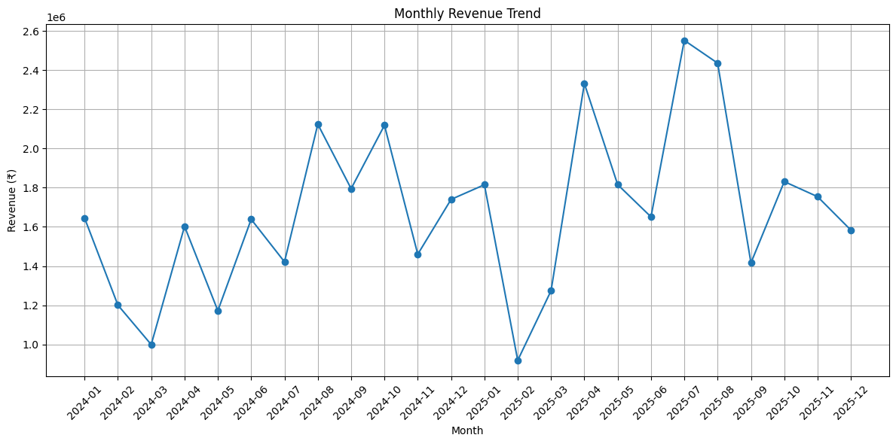
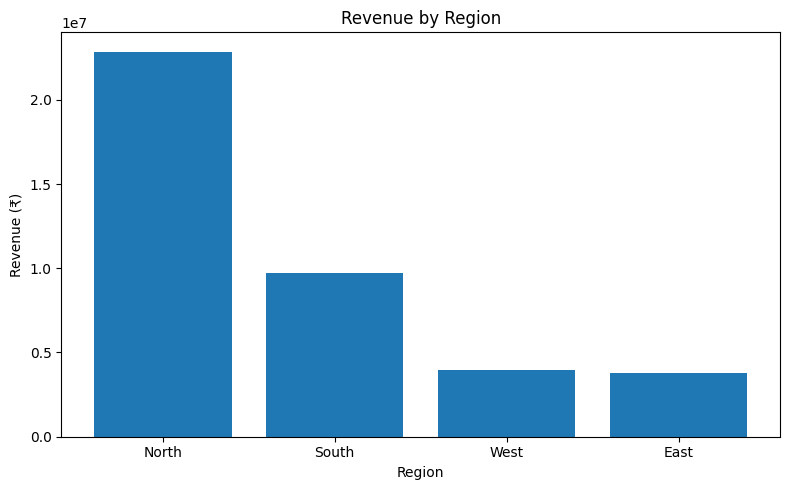
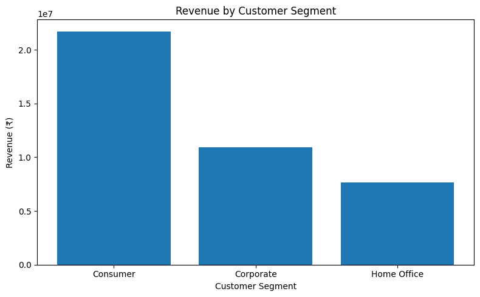

# 📊 E-Commerce Sales Analysis


## 📌 Project Overview

This project performs an end-to-end analysis of e-commerce sales data using **Python, SQL, and data visualization techniques** to uncover meaningful business insights.

The analysis covers **sales performance, customer behavior, product performance, regional trends, key business KPIs, and customer segmentation using RFM analysis**.

The project demonstrates a complete data analytics workflow, from **data cleaning and exploration to SQL analysis, visualization, and business insights**.

---

## 🎯 Project Objectives

The main objectives of this project are to:

- 📈 Analyze overall sales performance
- 📅 Identify monthly revenue trends
- 🛍️ Find the best-performing product categories
- 🌍 Analyze revenue across different regions
- ⭐ Identify top-performing products
- 👥 Identify high-value customers
- 💰 Calculate important business KPIs
- 🧩 Analyze customer segments
- 🎯 Perform RFM-based customer segmentation

---

## 📂 Dataset

The project uses three datasets:

### 👤 Customers Dataset

Contains customer-related information:

- Customer ID
- Customer Name
- Email
- City
- Signup Date
- Region
- Customer Segment

### 🛒 Orders Dataset

Contains transaction-related information:

- Order ID
- Customer ID
- Product ID
- Order Date
- Quantity
- Unit Price
- Discount
- Revenue

### 📦 Products Dataset

Contains product-related information:

- Product ID
- Product Name
- Category
- Price
- Stock Quantity

---

## 🧹 Data Cleaning & Preparation

The following data preparation steps were performed:

- Checked dataset structure and data types
- Identified missing values
- Converted date columns to datetime format
- Checked for duplicate records
- Removed duplicate rows from the orders dataset
- Validated customer IDs, product IDs, and order IDs
- Prepared the data for analysis and visualization

---

# 📊 Key Business KPIs

| KPI | Value |
|---|---:|
| 💰 Total Revenue | ₹40,299,250.84 |
| 🛒 Total Orders | 1,253 |
| 👥 Total Customers | 400 |
| 💳 Average Order Value | ₹32,162.21 |

---

# 🔍 Key Insights

The analysis revealed the following insights:

- 🛋️ **Furniture** generated the highest revenue.
- 📱 **Electronics** was the second-highest revenue-generating category.
- 🌍 The **North region** generated the highest revenue.
- 👥 The **Consumer segment** generated the highest revenue.
- 🪑 **Wardrobe** was the highest revenue-generating product.
- 🏆 **Priya Singh** was the highest revenue-generating customer.
- 📈 Revenue showed fluctuations across different months.
- 🎯 RFM analysis identified multiple customer groups based on purchasing behavior.

---

# 👥 Customer Segmentation Using RFM Analysis

Customer segmentation was performed using the **RFM (Recency, Frequency, Monetary)** model.

### 🔹 Recency

Measures the number of days since a customer's most recent purchase.

### 🔹 Frequency

Measures how often a customer makes purchases.

### 🔹 Monetary

Measures the total revenue generated by a customer.

Based on these metrics, customers were categorized into:

| Customer Segment | Description |
|---|---|
| 🏆 Champion | High-value and highly engaged customers |
| 💎 Loyal Customer | Frequent customers with strong purchasing behavior |
| 🌱 Potential Loyalist | Customers with potential to become loyal |
| 👤 Regular Customer | Customers with moderate purchasing activity |
| ⚠️ At Risk | Previously valuable customers with declining activity |
| ❌ Lost Customer | Customers with low or no recent activity |

---

# 📈 Visualizations

The project includes the following visualizations:

### 📅 Monthly Revenue Trend



### 🛍️ Revenue by Product Category


### 🌍 Revenue by Region



### 👥 Revenue by Customer Segment



### 🏆 Top 10 Products by Revenue


### 💰 Top 10 Customers by Revenue


### 🎯 Customer Segmentation Distribution


---

# 🛠️ Technologies Used

- **Python**
- **Pandas**
- **Matplotlib**
- **SQL**
- **MySQL**
- **Google Colab**
- **Jupyter Notebook**

---

# 💻 SQL Analysis

SQL was used to perform business-focused analysis, including:

- Revenue analysis
- Customer analysis
- Product performance analysis
- Regional performance analysis
- Category-wise revenue analysis
- Top customers and products analysis
- Business KPI calculations

The SQL queries can be found here:

```text
sql/ecommerce_analysis.sql
